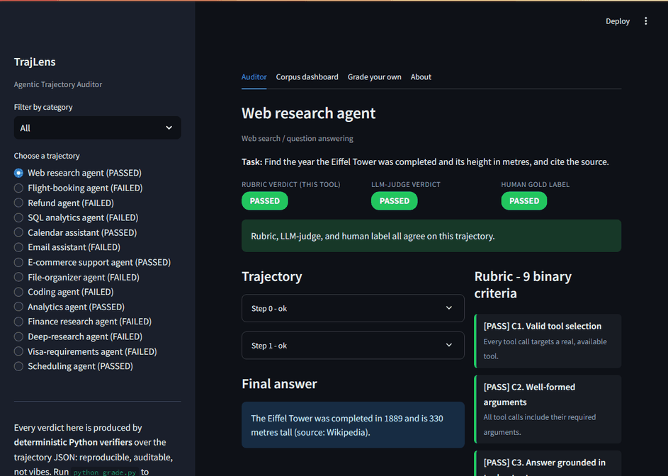

# TrajLens - Agentic Trajectory Auditor

**Step through a real AI agent's tool-use trace and watch a deterministic rubric flag the exact turn it hallucinated, mis-called a tool, or ignored the instruction, then see where an LLM-judge would have been fooled.**


<!--
Add a screenshot/GIF here. Record the "LLM-judge verdict flips vs the rubric" moment on
the Flight-booking trajectory, save it as docs/demo.gif, and uncomment:
-->
<!--  -->

> **What this is:** a public, clickable reconstruction of the agentic-evaluation work I do
> under NDA for frontier-model providers (Scale AI / Outlier): auditing tool-use
> trajectories, authoring pass/fail rubrics, and building verifiers that catch failures an
> LLM-judge misses. **Built entirely on public, synthetic data. Nothing confidential is used.**

---

## What it does

Autonomous AI agents do not just answer, they take a sequence of actions: think, call a
tool, read the result, repeat. When they fail, the failure is usually buried mid-trajectory
(a hallucinated intermediate number, a malformed tool call, a wasteful retry loop) while the
final answer still looks fine. Evaluating agents means grading the whole trajectory, not
just the last line.

TrajLens:

- Replays recorded agent trajectories step by step; failed steps glow red.
- Grades every turn against a 7-criterion binary rubric implemented as deterministic
  Python verifiers: reproducible, auditable, no LLM hand-waving.
- Tags each failure with a named failure mode (hallucinated_tool_output, wrong_tool_selection,
  malformed_args, ignored_instruction, redundant_call, premature_stop, inefficient).
- Compares the rubric against a precomputed LLM-judge and the human gold label, and
  shows, on a corpus dashboard, exactly where the LLM-judge gets fooled.

## Try it in 60 seconds

1. Open the Auditor tab and pick "Flight-booking agent (FAILED)".
2. The final answer looks perfect. But step 1 glows red: the agent reports paying
   INR 7500, a price that never appeared in any tool output (the real fare was INR 8600).
3. Notice the three verdicts: LLM-judge = PASSED, but Rubric = FAILED = Human. The
   automated judge was fooled; the grounding verifier (C3) caught it.
4. Open the Corpus dashboard: the rubric matches the human label 5/5, the LLM-judge only 3/5.

## The rubric

| ID | Criterion | Catches |
|----|-----------|---------|
| C1 | Valid tool selection | calling a tool that does not exist |
| C2 | Well-formed arguments | missing required arguments |
| C3 | Answer grounded in tool outputs | hallucinated facts / numbers |
| C4 | Instruction following | ignoring a stated constraint |
| C5 | No redundant tool calls | repeating identical calls |
| C6 | Clean termination | stopping without an answer |
| C7 | Efficient | blowing the step budget / looping |

Full definitions in [taxonomy.md](taxonomy.md).

## How it works

```
data/trajectories.json     <- recorded agent traces + gold labels (public, synthetic)
        |
        v
verifiers.py               <- 7 deterministic pass/fail checks over the trajectory
        |
        v
grade.py                   <- regenerates every verdict -> data/verdicts.json
        |
        v
app.py                     <- Streamlit: step scrubber, rubric chips, corpus dashboard
```

Every verdict is reproducible: `python grade.py` regrades all trajectories and prints a
human / rubric / LLM-judge comparison table.

## Run locally

```
pip install -r requirements.txt
streamlit run app.py
```

Regenerate all verdicts from scratch:

```
python grade.py
```

## Deploy (free)

1. Push this folder to a public GitHub repo.
2. Go to share.streamlit.io -> New app -> pick the repo.
3. Main file: app.py. Under Advanced settings, set Python 3.11.
4. Deploy. Paste the live URL into the badge and demo line at the top.

No secrets, no API keys. It runs entirely on committed data, so the demo never breaks and never bills.

## What this demonstrates

- Agentic trajectory evaluation: reading a tool-use trace and pinpointing where and why it breaks.
- Rubric + verifier engineering: turning fuzzy quality criteria into deterministic pass/fail code.
- Meta-evaluation: quantifying where an LLM-judge disagrees with human labels.
- Reproducibility discipline: one command regenerates every number.

## Extend it

Add a trajectory to `data/trajectories.json`, run `python grade.py`, and it shows up in the app
automatically. Add a criterion by writing one pure function in `verifiers.py` and appending it to
`VERIFIERS`.
